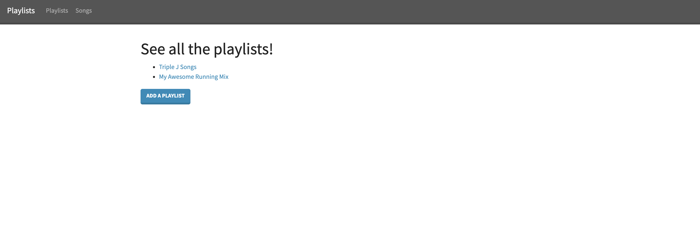
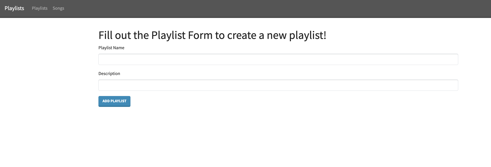
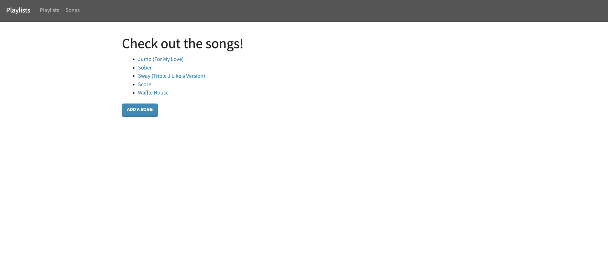
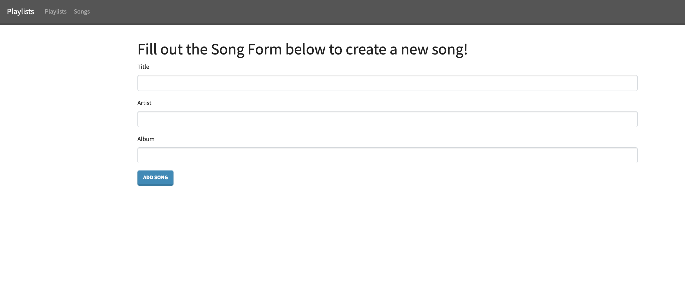
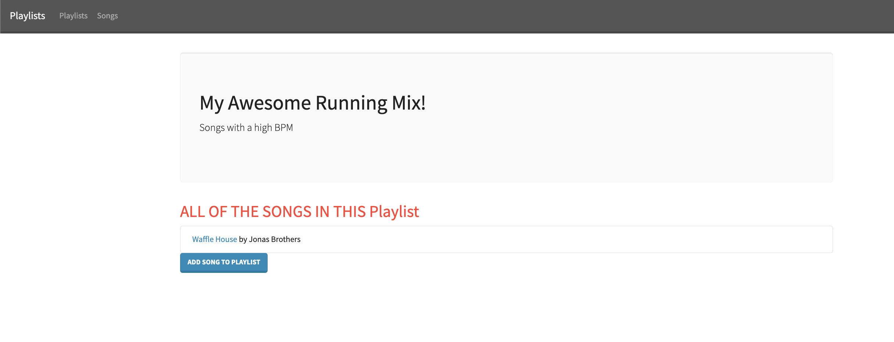
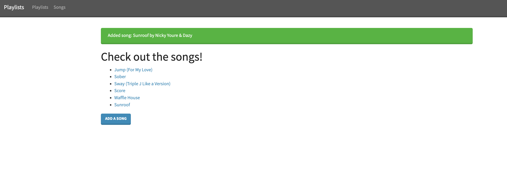
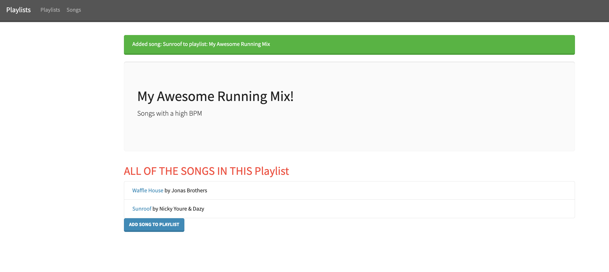

# Playlist-app Exercise

A flask application for managing data about playlists and songs, built with Flask, SQLAlchemy, and Bootstrap. Anyone can view and add playlists and songs. This isn't a full CRUD project, but is an exercise to pracice full-stack web development concepts with Python (inlcuding Jinja templates).   

## Table of Contents

- [Overview](#overview)
  - [Features](#features)
  - [Sreenshot](#screenshots)
- [Built With](#built-with)
- [Getting Started](#getting-started)
  - [Setup Instructions](#setup-instructions)
  - [Continued development](#continued-development)
- [Routes](#routes)
- [Author](#author)
- [Acknowledgments](#acknowledgments)

### Features
- View a list of all playlists and songs
- Add a new playlist, song, and M2M relationship via WTforms
- Responsive, Bootstrap-styled UI

### Screenshots

## Built With
- **Python**: Backend logic and routing.
- **Jinja2**: Python template engine that works with Flask
- **Flask**: Web framework for building the application.
- **SQLAlchemy**: ORM for database management.
- **Bootstrap**: Frontend styling and responsive design.
- **HTML5**: Markup for the UI.

## Getting Started

### Setup Instructions
To get this application running, make sure you do the following in the Terminal:

1. `python3 -m venv venv`
2. `source venv/bin/activate`
3. `pip install -r requirements.txt`
4. `createdb playlist-app`
5. `flask run`

## Routes
- `GET /playlits` — List all playlists
- `GET /playlits/add` — Show form to add a playlist
- `POST /playlits/add` — Add new playlist to the DB
- `GET /playlits/<playlist_id>` — Show selected playlist
- `GET /songs` — List all songs 
- `GET /songss/<song_id>` - Show selected song
- `GET /songs/add` — Show form to add a song
- `POST /songss/add` — Add new song to the DB
- `GET /playlits/<playlist_id>/add-song` — Show form to add a song to a playlist
- `POST /playlits/<playlist_id>/add-song` — Add the choosen song to a playlist to the DB

## Author
- Github - [DNel2](https://github.com/TechEdDan2)
- Frontend Mentor - [@TechEdDan2](https://www.frontendmentor.io/profile/TechEdDan2)

## Acknowledgments
The YouTubers and other educational resources I have been learning from include: Coder Coder (Jessica Chan), BringYourOwnLaptop (Daniel Walter Scott), Kevin Powell, vairous Udemy courses, and Stony Brook University's Software Engineering Bootcamp (Colt Steele)  